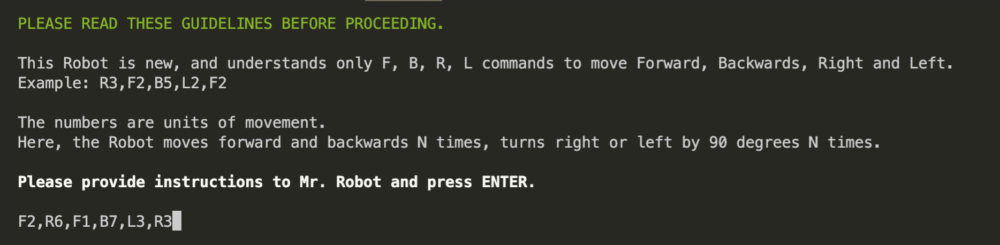
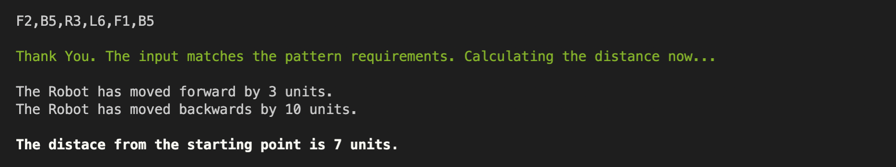
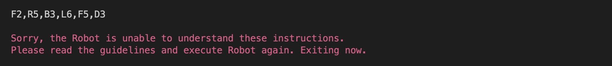

# The Robot

This is a simple program which receives commands in order to move a robot, and finally calculates the distance of the robot from the starting point.

## Description

The robot receives commands from the user to move. These commands will tell the robot to move forwards or backwards, and turn left or right. The commands will be in the format <command><number>.
  
  For example 'L1' means 'turnn left by 90 degrees once', 'B2' would mean go backwards by 2 units.
  
  ### Available commands
  
  * `F` - Move forward 1 unit
  * `B` - Move backward 1 unit
  * `R` - Turn right 90 degrees
  * `L` - Turn left 90 degrees
  
  ### Valid inputs
  
  ```bash
  R2,F1,B7,L3,F1
  b2,F6,r2,L10
  ```
  
  ### Incorrect inputs
  
  ```bash
  X3,R6,L3,F3
  F4,L9,B1,S1,F1
  ```

## Docker image

A docker image of this program is available in Docker Hub. Pull this image and run it in a docker container.

```
docker pull ashishv82/robot
```

If docker is not availailble, checkout the following options on how to execute this program.

## Getting Started

### Requirements

* Bash with version > 3
* Tested on Ubuntu, Alpine, Debian, MacOS, [Windows Git Shell](https://git-scm.com/download/win)

Basically, it will work anywhere you can install Bash.

## How to use

To clone and run this application, you'll need [Git](https://git-scm.com) installed on your computer. From your command line:

```bash
# Clone this repository
$ git clone https://github.com/ashishv-82/my-robot.git

# Go into the repository
$ cd my-robot

# Run the app
$ bash robot.sh
```
If you wish to bypass git, download the file directly from the Github repository by right-clicking it and saving the target file on your computer. Execute it in bash using the command: `bash robot.sh`

### User prompt

<p align="left">
  
</p>

### Successful execution

<p align="left">
  
</p>

### Invalid user inputs

<p align="left">
  
</p>

## Contributing
Pull requests are welcome. For major changes, please open an issue first to discuss what you would like to change.
  
Please make sure to update tests as appropriate.

## Version History

* 0.1 - Initial Release

## Author
  
Ashish Verma
  
## License
>You can check out the full license [here](https://github.com/ashishv-82/my-robot/blob/main/LICENSE)

This project is licensed under the terms of the **MIT** license.
